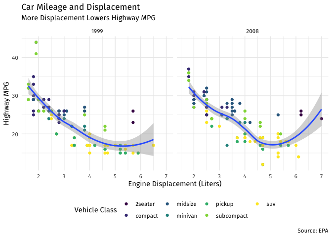

---
categories:
- rstats
- teaching
comments: true
date: 2019-10-18T13:47:00
tags:
- rstats
- econometrics
- data science
- tidyverse
- blog
title: If You're Going to Learn R, Learn the Tidyverse
---

This is an opinionated post based on how I teach [my undergraduate
econometrics course](http://metricsf19.classes.ryansafner.com). It will
not be for everybody. The title applies mostly to anyone who wants to do
[data science or
econometrics](https://ryansafner.com/post/econometrics-data-science-and-causal-inference/)
with R. This is the second time I have taught this course with R, and I
have changed it around in many ways that I think optimize the process
for students. In this post, I’ll cover just two major changes:

1.  Learn R before the econometric/statistical theory
2.  Learn *tidyverse* R, specifically

The [last time I taught this
course](http://ryansafner.com/courses/econ480) (and my first exploration
with R), I did neither. Part of this was because I had just learned base
R a few months before the course began, and was still learning and
discovering new commands as the semester went on. I waited several weeks
to introduce R, starting instead with econometric theory and review, and
then interspersing bits of R as it became relevant for each task
(running regressions, making plots, changing variables, and various
different models). While it was fine for most students, there are some
changes that will make students’ lives easier.

I am still partway through the course, so it remains to be seen if
students R skills are more developed by the end of the course (as they
wrap up their projects) because they learned a lot of R *first*, versus
in bite-sized chunks spread out over the semester.

`tidyverse` and Opinionated R
-----------------------------

> The tidyverse is an opinionated [collection of R
> packages](https://www.tidyverse.org/packages) designed for data
> science. All packages share an underlying design philosophy, grammar,
> and data structures. - [tidyverse.org](https://www.tidyverse.org/)

One of the common refrains about what is awesome/terrible about R is
that there are multiple ways to accomplish the same task. Here is where
the opinions begin, so I’ll give mine: Code written with tidyverse
packages simply looks a lot better and is far easier for *humans* to
read, particularly if you follow the [style
guidelines](https://style.tidyverse.org/), as I do.

For example, the following code takes data from the excellent
[gapminder](https://github.com/jennybc/gapminder) dataset and package,
and subsets the data to:

1.  look only at U.S. observations
2.  keep only the `year`, `gdpPercap` and `pop` variables
3.  create a new variable called `GDP` by multiplying `gdpPercap` and
    `pop`

<!-- -->

    gapminder1<-gapminder[gapminder$country=="United States", c("year", "gdpPercap", "pop")]

    gapminder1$gdp<-gapminder1$gdpPercap*gapminder1$pop

This is doable in base R, and often requires saving the output as a new
object for later use.

Below, the same procedure is done with `dplyr` and using the pipe `%>%`
from `magrittr` (both part of the `tidyverse`).

    gapminder %>%
      filter(country == "United States") %>%
      select(year, gdpPercap, pop) %>%
      mutate(GDP=gdpPercap * pop)

    ## # A tibble: 12 x 4
    ##     year gdpPercap       pop     GDP
    ##    <int>     <dbl>     <int>   <dbl>
    ##  1  1952    13990. 157553000 2.20e12
    ##  2  1957    14847. 171984000 2.55e12
    ##  3  1962    16173. 186538000 3.02e12
    ##  4  1967    19530. 198712000 3.88e12
    ##  5  1972    21806. 209896000 4.58e12
    ##  6  1977    24073. 220239000 5.30e12
    ##  7  1982    25010. 232187835 5.81e12
    ##  8  1987    29884. 242803533 7.26e12
    ##  9  1992    32004. 256894189 8.22e12
    ## 10  1997    35767. 272911760 9.76e12
    ## 11  2002    39097. 287675526 1.12e13
    ## 12  2007    42952. 301139947 1.29e13

The beauty of `tidyverse` (particularly `dplyr`, which will be used the
most for data wrangling) comes from a few features:

1.  It uses active, common sense, natural language verbs to accomplish
    most of its tasks. `filter`, `select`, and `mutate` (among others)
    are easy to understand what is happening at each stage.
2.  It allows use of the pipe `%>%` to chain commands into a single
    sequence (and better yet, every time I use a pipe, I start a new
    line to make code far more readable).
3.  It *shows* you the output by default and does not store (or
    overwrite) it anywhere until or unless you assign it to an object.
    This allows you to preview what your code does before you need to
    worry about saving it.

Note that this can be done without use of the pipe, and by storing
objects, as such:

    gapminder_US<-filter(gapminder, country == "United States")
    gapminder_US<-select(gapminder_US, year, gdpPercap, pop)
    gapminder_US<-mutate(gapminder_US, GDP=gdpPercap * pop)
    gapminder_US

    ## # A tibble: 12 x 4
    ##     year gdpPercap       pop     GDP
    ##    <int>     <dbl>     <int>   <dbl>
    ##  1  1952    13990. 157553000 2.20e12
    ##  2  1957    14847. 171984000 2.55e12
    ##  3  1962    16173. 186538000 3.02e12
    ##  4  1967    19530. 198712000 3.88e12
    ##  5  1972    21806. 209896000 4.58e12
    ##  6  1977    24073. 220239000 5.30e12
    ##  7  1982    25010. 232187835 5.81e12
    ##  8  1987    29884. 242803533 7.26e12
    ##  9  1992    32004. 256894189 8.22e12
    ## 10  1997    35767. 272911760 9.76e12
    ## 11  2002    39097. 287675526 1.12e13
    ## 12  2007    42952. 301139947 1.29e13

[I am not alone in this
view.](http://varianceexplained.org/r/teach-tidyverse/) As far as it
relates to teaching, the implications are clear: The overwhelming
majority of students are new to “programming”, so they will be
frustrated *regardless* of what order the content was taught, or in what
flavor of language. They do not need to know the “base R” way of doing
something just so that they can see that the tidyverse may be better or
more efficient - they just need to learn *one* way to accomplish their
task, it might as well be (what I think is) the “better” one.

So, I began the course (after two days of overview, why this course is
important, useful, etc.) with 4 intensive classes of learning R, and
tidyverse specifically. First, a day about base R, second, a day about
ggplot2 for data visualization, third, a day of data wrangling with
tidyverse, and finally a day about workflow and other tools (mainly r
markdown). I cover the basics behind each of them, and what I have
learned, below:

Class 1: Is Base R Necessary?
-----------------------------

It somehow seems more “pure” to teach R from the ground up: First we
discuss basic R commands, then we build more complicated functions in,
then we show how to manipulate data, then we show how to plot, and
later: “oh by the way there are these packages that do all of this more
elegantly and in half as many lines of code.” That is how I taught
econometrics last year.

We need to remember this is a class in econometrics and data analysis
that *uses* R, not a class in computer science or the R language. In
fact, people with a computer science/programming background seem to find
R [particularly annoying as a programming
language](https://www.youtube.com/watch?v=6S9r_YbqHy8&feature=youtu.be).
It is highly domain-specific (that domain chiefly being statistics), and
should be appreciated as such.

In any case, I still made a point this year to make [my first R-based
class](https://metricsf19.classes.ryansafner.com/class/03-class/)
entirely about Base R without the bells and whistles.^[Though I allude to more complex examples to give them a taste of
what’s to come!] Students and
R-users need to understand some basic syntax of functions, as well as
the object-oriented nature of the language. I made sure that they
understand the following really well:

1.  What are packages, how to find, install, and load them.
2.  How to get help in R and on the internet for R functions.
3.  Different types of objects: especially `vector` and `data.frame`
4.  Different data classes: especially `numeric` and `character`, and
    how to check them
5.  Some basic functions for making vectors and for getting statistics
    (`c()`, `mean()`, `sd()`, etc.)
6.  The basics of data frames: recognizing each column is a vector, how
    to summarize them, how to subset by row, column, and element

I try not to go overboard (I omit things like `factor` and `logical`
classes, `list` or `matrix` objects) and tell them not to worry too much
about manipulating dataframes in Base R, as that is what `tidyverse`
will accomplish much more intuitively and efficiently.

Class 2: Data Visualization with `ggplot2`
------------------------------------------

The [second
R-class](https://metricsf19.classes.ryansafner.com/class/04-class/) I
taught students all about data visualization with `ggplot2`. Not only do
I think it is aesthetically superior to anything from Base R,^[If it was not clear in my posts by now, I have high aesthetic
standards.] it also
allows students to think about the important elements of a plot, and
optimize each one accordingly, with the “grammar of graphics.” This is a
pretty steep learning curve compared to typing `plot(y,x)` and seeing a
scatterplot appear, but in the end, it is worth it.

In class, I build a few plots layer by layer:

1.  `data`
2.  `aes`thetics
3.  `geom`etric objects
4.  `facets`
5.  `labels`
6.  `scale`s
7.  `theme`

At each layer, I explain what each layer does and many of the
possibilities for each layer.

    ggplot(data = mpg)+
      aes(x = displ,
            y = hwy)+
      geom_point(aes(color = class))+
      geom_smooth()+
      facet_wrap(~year)+
      labs(x = "Engine Displacement (Liters)",
           y = "Highway MPG",
           title = "Car Mileage and Displacement",
           subtitle = "More Displacement Lowers Highway MPG",
           caption = "Source: EPA",
           color = "Vehicle Class")+
      scale_color_viridis_d()+
      theme_minimal()+
      theme(text = element_text(family = "Fira Sans"),
            legend.position="bottom")

This is also the students’ first exposure to `tidyverse`, though it is
not yet apparent. My one regret, in retrospect, is that plot layers are
combined with `+` instead of `%>%`.^[I believe this is due to the unique history of `ggplot2` coming
before the `tidyverse` was a full idea. Though I hear in future
versions, this may be fixed!] After learning other `tidyverse`
packages such as `dplyr`, students would try to add plot layers with
`%>%` but I would continuously have to remind them that layers are
combined with `+`.

Recall, all of this is done well before we cover basic statistics or
econometric theory. When I was teaching students *how* to construct
various plots with `ggplot2`, this was before they knew *why* they
needed a scatterplot or a boxplot.

Class 3: Data Wrangling with `tidyverse` (mostly `dplyr`)
---------------------------------------------------------

The [third
class](https://metricsf19.classes.ryansafner.com/class/05-class/) was
all about `tidyverse` as a unifying set of packages with a common
philosophy and grammar. I did discuss several core packages:

1.  `tibble` for friendlier dataframes^[I simply replaced all dataframes in the course with tibbles.]
2.  `magrittr` for using the pipe `%>%` to chain code together
3.  `readr` for importing data (mostly `.csv`^[And derivative packages such as `readxl` and `haven` for importing
other types of data such as `.xlsx` or Stata’s `.dat`.]
4.  `tidyr` for reshaping data

But the primary focus was on `dplyr` and its verbs:

1.  `filter()` to keep selected observations
2.  `select()` to keep selected variables
3.  `arrange()` to reorder observations by a value
4.  `mutate()` to create new variables
5.  `summarize()` to create summary statistics
6.  `group_by()` for performing operations by group

We worked with gapminder data to accomplish a wide variety of tasks
using these commands.

Class 4: Optimizing Workflow: R Projects and Markdown
-----------------------------------------------------

The [fourth and final
class](https://metricsf19.classes.ryansafner.com/class/06-class/)
dedicated to R was all about optimizing workflow with a few tweaks. I
have not used Microsoft Office products in about 10 years (more posts to
come later), and in the last year, have migrated **ALL** of my
document-preparation (that’s research papers, teaching materials, exams,
slides, websites, *everything*) to markdown files I write inside of R
Studio and track with version control on GitHub.

When I show to students that there are other options to Microsoft Word
and Powerpoint, their jaws drop, particularly when I show all that you
can do with a single plain-text document (integrating text, code,
commands, plots, citations and bibliography etc) that exports to pdf,
html, slides, and other output. Last semester, after I showed them
`R Markdown`, several students told me it was the best thing about the
class, and some still use it for other assignments in other classes on
their own. This deserves its own series of posts, so for now I will
focus on the two or three things I tried to teach students *in addition*
to how to use Markdown.

First, **R Projects** are absolutely essential. I discovered these late
in the game last year, but now realized that they solve far more
problems than trying to do without them.

The \#1 unnecessary problem I encounter with students is trying to load
data from external sources. The world is not full of tidy pre-cleaned
data, or even data that only come in `.csv` formats. `tidyr` is great
for that, and so is `readr`, but the problem actually is one of basic
file operations on a computer: students (and R) don’t know where the
data is saved on their computers! Rather than trying to teach them how
to write out relative or absolute file paths to locate files on their
computer, R Projects solve this problem by setting the default working
directory to the folder where the project is stored on their computer.
That means that if you store the data file in that folder, you only need
to load it (with `readr` or equivalent) with (e.g.)
`read_csv("thedata.csv"`), no more worrying about file paths!

I also encourage students to create a logical folder hierarchy within
their projects, similar to what I show in [this
repository](https://github.com/ryansafner/workflow).

Second, **version control** with Github. I never actually got around to
showing this in class, but a number of students expressed interest in
learning how to do this. I feel it’s a bit advanced and requires a bit
more computing expertise (but not too much, since I’m able to pull it
off!), but I use it constantly. Perhaps more posts on this later.

In any case, after teaching these workflow methods, looking back on the
first 3 R classes, I am tempted to just start from scratch with projects
and markdown and make students use them from the beginning. Perhaps next
year.
