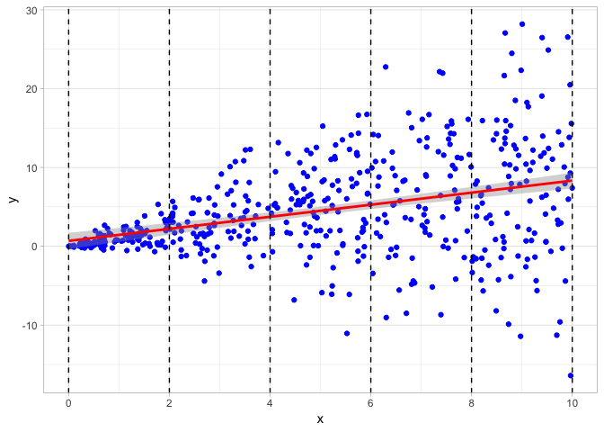
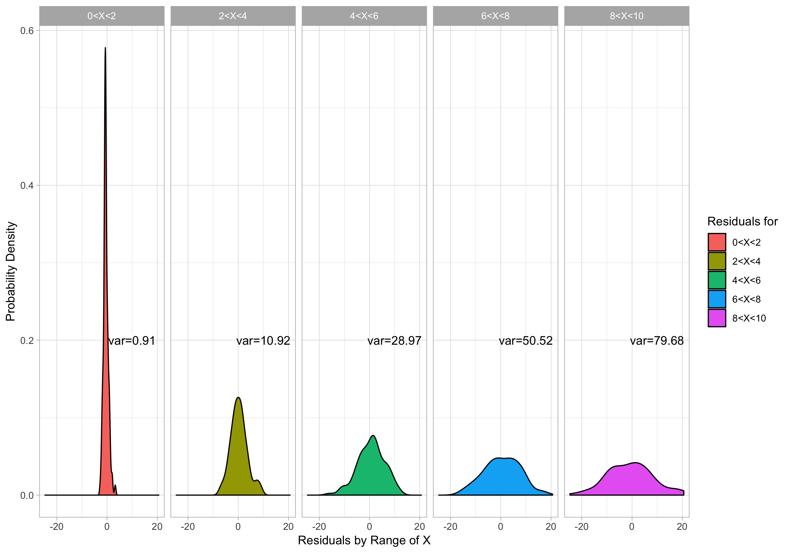

---
categories:
- rstats
- teaching
comments: true
date: 2018-12-28T20:11:00
tags:
- rstats
- stata
- teaching 
- econometrics
title: Replicating Stata's 'Robust' Option for OLS Standard Errors in R
---

One of the advantages of using Stata for linear regression is that it can automatically use heteroskedasticity-robust standard errors simply by adding `, r` to the end of any regression command. Anyone can more or less use robust standard errors and make more accurate inferences without even thinking about what they represent or how they are determined since it's so easy just to add the letter `r` to any regression.   

In `R`, robust standard errors are not "built in" to the base language. There are a few ways that I've discovered to try to replicate Stata's "robust" command. None of them, unfortunately, are as simple as typing the letter `r` after a regression. Each has its ups and downs, but may serve different purposes. 

Below, I will demonstrate the two methods, but first, let's create some random data that will have heteroskedastic residuals. 


```R
set.seed(20)
# draw 500 observations from a random uniform distribution (runif) between 0 and 10.  
x<-runif(500,0,10)

# draw 500 observations from a random normal distribution
y<-rnorm(500,mean=x,sd=x) # set mean and sd are set as the value of each x value
# thus, as x gets larger, so does the sd, and thus the residuals

data<-data.frame(x,y) # make x and y variables in a dataframe called "data"
```

We then run a regression of `y` on `x`: 


```{r}
reg<-lm(y~x)
summary(reg)
```

```
## 
## Call:
## lm(formula = y ~ x)
## 
## Residuals:
##      Min       1Q   Median       3Q      Max 
## -24.7115  -2.4865  -0.3479   2.9699  20.6123 
## 
## Coefficients:
##             Estimate Std. Error t value Pr(>|t|)    
## (Intercept)  0.68508    0.52264   1.311    0.191    
## x            0.76484    0.08887   8.607   <2e-16 ***
## ---
## Signif. codes:  0 '***' 0.001 '**' 0.01 '*' 0.05 '.' 0.1 ' ' 1
## 
## Residual standard error: 5.949 on 498 degrees of freedom
## Multiple R-squared:  0.1295,	Adjusted R-squared:  0.1277 
## F-statistic: 74.08 on 1 and 498 DF,  p-value: < 2.2e-16
```

Let's plot a scatterplot to visualize the data and add the regression line. Clearly, the data is "fan" shaped, centered on the regression line, but with larger and larger residuals (distance between the regression line and the data point, $\hat{\epsilon}_i=\hat{Y}_i-Y_i$) as $X$ gets larger.  



I have also broken up the scatterplot into 5 different sections over the range of `x` values. Below, I plot density plots of the residuals over each of the 5 different ranges of `x` values, and we can clearly see that the variance of the residuals dramatically increases as `x` increases. 



Using the `lmtest` package, we can also formally run a Breusch-Pagan test for heteroskedasticity. 

```r
library("lmtest")
bptest(reg)
```

```
## 
## 	studentized Breusch-Pagan test
## 
## data:  reg
## BP = 90.547, df = 1, p-value < 2.2e-16
```

## Method 1: `Sandwich` package 

In order to understand what the "fix" in this method is actually doing, we also need to look "under the hood" of what `R` is doing when it runs OLS and stores everything in the `lm` regression object.

One thing stored in `reg` is the variance-covariance matrix, estimating the covariance of each OLS estimator (the "betas") with every other OLS estimator:

$$ \begin{pmatrix} cov(\hat{\beta_0},\hat{\beta_0}) & cov(\hat{\beta_0},\hat{\beta_1}) & \cdots & cov(\hat{\beta_0},\hat{\beta_k})\\\\\\ cov(\hat{\beta_1},\hat{\beta_0}) & cov(\hat{\beta_1},\hat{\beta_1}) & \cdots & cov(\hat{\beta_1},\hat{\beta_k})\\\\\\ \vdots & \vdots & \ddots & \vdots \\\\\\ cov(\hat{\beta_k},\hat{\beta_0}) & cov(\hat{\beta_k},\hat{\beta_1}) & \cdots & cov(\hat{\beta_k},\hat{\beta_k})\\\\\\ \end{pmatrix}$$

Since the covariance of anything with itself is the variance, the *diagonal* elements of this matrix are the variances of the OLS estimators:

$$\begin{pmatrix}var(\hat{\beta_0}) & cov(\hat{\beta_0},\hat{\beta_1}) & \cdots & cov(\hat{\beta_0},\hat{\beta_k})\\\\\\ cov(\hat{\beta_1}, \hat{\beta_0}) & var(\hat{\beta_1}) & \cdots & cov(\hat{\beta_1},\hat{\beta_k})\\\\\\ \vdots & \vdots & \ddots & \vdots \\\\\\ cov(\hat{\beta_k},\hat{\beta_0}) & cov(\hat{\beta_k},\hat{\beta_1}) & \cdots & var(\hat{\beta_k})\\\\\\ \end{pmatrix}$$

So if we look at the simple $2 \times 2$ variance-covariance matrix in our simple `reg` using `vcov`, we see. 


```r
vcov(reg)
```

```
##             (Intercept)            x
## (Intercept)  0.27315741 -0.039976551
## x           -0.03997655  0.007897029
```

We can extract just the diagonal of the matrix with `diag()`: 


```r
diag(vcov(reg))
```

```
## (Intercept)           x 
## 0.273157410 0.007897029
```

These are the variances of $\hat{\beta_0}$ and $\hat{\beta_1}$. Since the standard error of an estimator is the square root of its variance, we simply square root these values to get the standard errors of $\hat{\beta_0}$ and $\hat{\beta_1}$, which were originally reported in our regression output next to the coefficient estimates. 


```r
sqrt(diag(vcov(reg)))
```

```
## (Intercept)           x 
##  0.52264463  0.08886523
```

Now, the whole problem is we know that due to heteroskedasticity, the standard errors are incorrectly estimated. To fix this, we use the `sandwich` package that allows us to manually recalculate the variance-covariance matrix using methods robust to heteroskedasticity. This is why I went through the trouble of describing the variance-covariance matrix above, as we will be recalculating it using a different method, the `HC1` method, which is how Stata calculates it. I then store these calculates as `rse` in my original `lm` object called `reg`. 


```r
library("sandwich") # package that allows for robust SE estimation
# create Robust Standard Errors for regression as 'reg$rse'
reg$rse <-sqrt(diag(vcovHC(reg, type="HC1")))
# same procedure as above but now we generate vcov with "HC1" method
```

If we now want to recreate the regression output table produced by `summary(reg)`, we need to use the `coeftest` function, which is a part of the `lmtest` package. Just to verify, if we run `coeftest()` on our original `reg`, it prints the regression output table with coefficient estimates, standard errors, $t$-statistics, and $p$-values.


```r
coeftest(reg) # test with normal SEs
```

```
## 
## t test of coefficients:
## 
##             Estimate Std. Error t value Pr(>|t|)    
## (Intercept) 0.685077   0.522645  1.3108   0.1905    
## x           0.764836   0.088865  8.6067   <2e-16 ***
## ---
## Signif. codes:  0 '***' 0.001 '**' 0.01 '*' 0.05 '.' 0.1 ' ' 1
```

If we run it again, but set the `vcov` option to `ccovHC(reg, "HC1")`, it will print the robust standard errors. 


```r
coeftest(reg,vcov=vcovHC(reg,"HC1")) # tests with robust SEs
```

```
## 
## t test of coefficients:
## 
##             Estimate Std. Error t value  Pr(>|t|)    
## (Intercept) 0.685077   0.312060  2.1953    0.0286 *  
## x           0.764836   0.093579  8.1732 2.504e-15 ***
## ---
## Signif. codes:  0 '***' 0.001 '**' 0.01 '*' 0.05 '.' 0.1 ' ' 1
```

These command simply print the robust standard errors for us to see in the console as we run our analyses. If we want to take these and actually output them in a presentable regression table, we will use the well-known `stargazer` package, used to take `R` regression `lm` objects and print scholarly journal-quality regression tables. 

The nice thing is `stargazer` has an option to set where the standard errors are pulled from. We stored our robust standard errors in `reg` as a vector called `rse`. Below, I print the `stargazer` regression table (with several personalized options) for this webpage, showing the our regression twice, once with the normal standard errors, and the second time with the robust standard errors. For more, see [Jake Russ' cheat sheet](https://www.jakeruss.com/cheatsheets/stargazer/#robust-standard-errors-replicating-statas-robust-option).  


```r
library("stargazer")
stargazer(reg, reg, 
          se=list(NULL,reg$rse), 
          type="html",
          column.labels = c("Normal", "Robust SEs"), 
          title="Regression Results", 
          dep.var.caption = "",
          omit.stat=c("adj.rsq","f")) 
```

The key to notice is `se=list(NULL,reg$rse)`, which creates a list of objects from which to pull the standard errors for each regression in the table. The first regression uses the standard methods, needing no special source, so it is set to `NULL`. The second regression, also `reg`, uses our robust standard errors stored in `reg$rse`. The output of the table is below: 


<table style="text-align:center"><caption><strong>Regression Results</strong></caption>
<tr><td colspan="3" style="border-bottom: 1px solid black"></td></tr><tr><td style="text-align:left"></td><td colspan="2">y</td></tr>
<tr><td style="text-align:left"></td><td>Normal</td><td>Robust SEs</td></tr>
<tr><td style="text-align:left"></td><td>(1)</td><td>(2)</td></tr>
<tr><td colspan="3" style="border-bottom: 1px solid black"></td></tr><tr><td style="text-align:left">x</td><td>0.765<sup>***</sup></td><td>0.765<sup>***</sup></td></tr>
<tr><td style="text-align:left"></td><td>(0.089)</td><td>(0.094)</td></tr>
<tr><td style="text-align:left"></td><td></td><td></td></tr>
<tr><td style="text-align:left">Constant</td><td>0.685</td><td>0.685<sup>**</sup></td></tr>
<tr><td style="text-align:left"></td><td>(0.523)</td><td>(0.312)</td></tr>
<tr><td style="text-align:left"></td><td></td><td></td></tr>
<tr><td colspan="3" style="border-bottom: 1px solid black"></td></tr><tr><td style="text-align:left">Observations</td><td>500</td><td>500</td></tr>
<tr><td style="text-align:left">R<sup>2</sup></td><td>0.129</td><td>0.129</td></tr>
<tr><td style="text-align:left">Residual Std. Error (df = 498)</td><td>5.949</td><td>5.949</td></tr>
<tr><td colspan="3" style="border-bottom: 1px solid black"></td></tr><tr><td style="text-align:left"><em>Note:</em></td><td colspan="2" style="text-align:right"><sup>*</sup>p<0.1; <sup>**</sup>p<0.05; <sup>***</sup>p<0.01</td></tr>
</table>

A casual search around the internet, as well as the textbook that I use shows that this is the most common or reccomended method for achieving robust standard errors.

## Method 2: Using `estimatr`

I recently discovered another package called [`estimatr`](https://github.com/DeclareDesign/estimatr) that achieves the simplicity of changing a single word, just like in Stata. 

Loading the `estimatr` package, all we need to do is create a new regression (I'll call it `reg.robust`) and instead of running a normal linear model with `lm`, we run `lm_robust`, and set the standard errors `se_type="stata"` to calculate using the HC1 method (same as above). 


```r
library("estimatr")
reg.robust<-lm_robust(y~x,se_type = "stata")
summary(reg.robust)
```

```
## 
## Call:
## lm_robust(formula = y ~ x, se_type = "stata")
## 
## Standard error type:  HC1 
## 
## Coefficients:
##             Estimate Std. Error t value  Pr(>|t|) CI Lower CI Upper  DF
## (Intercept)   0.6851    0.31206   2.195 2.860e-02  0.07196   1.2982 498
## x             0.7648    0.09358   8.173 2.504e-15  0.58098   0.9487 498
## 
## Multiple R-squared:  0.1295 ,	Adjusted R-squared:  0.1277 
## F-statistic:  66.8 on 1 and 498 DF,  p-value: 2.504e-15
```

We can see the standard errors are now identical to the robust ones from the method above. 

One other nicety of `estimatr` is that [it can create `tidy data.frame` versions](https://declaredesign.org/r/estimatr/articles/estimatr-in-the-tidyverse.html) of `R` default regression output tables, much like the `broom` package in the `tidyverse`. We do this simply with the `tidy()` command on our `reg.robust`. 


```r
tidy(reg.robust)
```

<div data-pagedtable="false">
  <script data-pagedtable-source type="application/json">
{"columns":[{"label":["term"],"name":[1],"type":["chr"],"align":["left"]},{"label":["estimate"],"name":[2],"type":["dbl"],"align":["right"]},{"label":["std.error"],"name":[3],"type":["dbl"],"align":["right"]},{"label":["statistic"],"name":[4],"type":["dbl"],"align":["right"]},{"label":["p.value"],"name":[5],"type":["dbl"],"align":["right"]},{"label":["conf.low"],"name":[6],"type":["dbl"],"align":["right"]},{"label":["conf.high"],"name":[7],"type":["dbl"],"align":["right"]},{"label":["df"],"name":[8],"type":["dbl"],"align":["right"]},{"label":["outcome"],"name":[9],"type":["chr"],"align":["left"]}],"data":[{"1":"(Intercept)","2":"0.6850766","3":"0.31205969","4":"2.195338","5":"2.860001e-02","6":"0.07196079","7":"1.2981925","8":"498","9":"y"},{"1":"x","2":"0.7648365","3":"0.09357893","4":"8.173169","5":"2.503856e-15","6":"0.58097828","7":"0.9486946","8":"498","9":"y"}],"options":{"columns":{"min":{},"max":[10]},"rows":{"min":[10],"max":[10]},"pages":{}}}
  </script>
</div>

Until today, I thought that was all `estimatr` could do: it could show us the robust standard errors, but we could not present it in an output table with `stargazer`. `lm_robust` objects do not get along well with `stargazer`, only `lm` objects. 

Documentation is extremely scarce, but there is a `starprep()` command to enable use of `estimatr` `lm_robust` objects with `stargazer`. After a lot of searching and trial and error, the process seems to be that using `starprep` extracts *only* the (robust) standard errors from the `lm_robust` regression, meaning we just need to insert this into `stargazer`'s `se=` option. 


```r
# this is what starprep extracts
starprep(reg.robust)
```

```
## [[1]]
## (Intercept)           x 
##  0.31205969  0.09357893
```

Below, again, I run `stargazer` on our original `reg` twice, with the second instance using robust standard errors via `estimatr`. Specifically notice the list for `se`; again, like the fist method above, we use the default for the first regression (hence `NULL`), and for the second, we use `starprep(reg.robust)` to extract from `estimatr`. 


```r
stargazer(reg, reg, 
          se=starprep(reg,reg.robust), 
          type="html",
          column.labels = c("Normal", "Robust SEs"), 
          title="Regression Results", 
          dep.var.caption = "",
          omit.stat=c("adj.rsq","f")) 
```


<table style="text-align:center"><caption><strong>Regression Results</strong></caption>
<tr><td colspan="3" style="border-bottom: 1px solid black"></td></tr><tr><td style="text-align:left"></td><td colspan="2">y</td></tr>
<tr><td style="text-align:left"></td><td>Normal</td><td>Robust SEs</td></tr>
<tr><td style="text-align:left"></td><td>(1)</td><td>(2)</td></tr>
<tr><td colspan="3" style="border-bottom: 1px solid black"></td></tr><tr><td style="text-align:left">x</td><td>0.765<sup>***</sup></td><td>0.765<sup>***</sup></td></tr>
<tr><td style="text-align:left"></td><td>(0.094)</td><td>(0.089)</td></tr>
<tr><td style="text-align:left"></td><td></td><td></td></tr>
<tr><td style="text-align:left">Constant</td><td>0.685<sup>**</sup></td><td>0.685</td></tr>
<tr><td style="text-align:left"></td><td>(0.312)</td><td>(0.523)</td></tr>
<tr><td style="text-align:left"></td><td></td><td></td></tr>
<tr><td colspan="3" style="border-bottom: 1px solid black"></td></tr><tr><td style="text-align:left">Observations</td><td>500</td><td>500</td></tr>
<tr><td style="text-align:left">R<sup>2</sup></td><td>0.129</td><td>0.129</td></tr>
<tr><td style="text-align:left">Residual Std. Error (df = 498)</td><td>5.949</td><td>5.949</td></tr>
<tr><td colspan="3" style="border-bottom: 1px solid black"></td></tr><tr><td style="text-align:left"><em>Note:</em></td><td colspan="2" style="text-align:right"><sup>*</sup>p<0.1; <sup>**</sup>p<0.05; <sup>***</sup>p<0.01</td></tr>
</table>

Again, we can see both methods achieve results identical to Stata. The nice thing about `estimatr` is we do not need to mess around with the variance-covariance matrix! 
